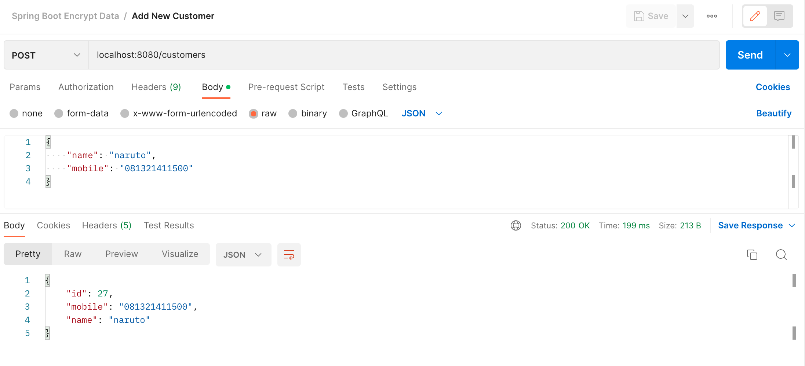

# spring-boot-encrypt-data

Encrypt PII ( Personally Identifiable Information ) sensitive data in the database using Spring Boot AttributeConverter
with direct search capabilities

### Objective

Enable encryption of certain fields in a datastore.
The data will be encrypted when persisting in the database and will be decrypted when it’s being read from the DB into
the entity object.
The repository methods should work seamlessly without requiring the service layer to explicitly encrypt and pass for
matching or lookup.

### Define the AttributeConverter

An AttributeConverter is a specific interface that provides the capability to transform an attribute ( field ) before
persisting and also while retrieving from the database. We will be defining an AttributeConverter that will encrypt the
data before persisting to DB and also the logic to decrypt the field when retrieving.

Once defined, an AttributeConverter can be mapped into an entity field using @Converter annotation and Spring will
invoke the AttributeConverter whenever the field is being persisted or retrieved to or from DB respectively.

### Saving the customer

Let’s call the API to save the customer and ensure that the mobile and name fields are encrypted and persisted in the
database.



```shell
curl --location --request POST 'localhost:8080/customers' \
--header 'Content-Type: application/json' \
--data-raw '{
    "name": "naruto",
    "mobile": "081321411500"
}'
```

### Read the profile using mobile (findBy)

Let’s call the API to find the customer by mobile. Note that here we pass the search string as plain text and JPA will
do the encryption and matching internally.

")

```shell
curl --location --request GET 'localhost:8080/customers/find/mobile/081321411500'
```

### Read the profile using mobile (JPQL query)

")

```shell
curl --location --request GET 'localhost:8080/customers/find/mobile/jql/081321411500'
```

#### Encrypting / Decrypting in DB

If there are cases where you want to have the data encrypted or decrypted in the DB during select, that is also possible
if you know the secret key. Usually, it’s recommended to have the key and decryption only managed by the application
only. But for cases like encrypting an existing database field, we can use the built-in methods available in the
respective DB engine.

For example, in the case of MySQL, I can issue the below commands for encrypting and decrypting using the key. Note that
I am using the aes specific methods.

```sql
-- Encrypt an existing DB field
UPDATE CUSTOMERS SET name=CAST(to_base64(aes_encrypt(name,"secret-key-12345")) AS char) WHERE id = 10;

-- Decrypt and select the encrypted fields
SELECT id,name,mobile,
CAST(aes_decrypt(from_base64(name),"secret-key-12345") AS char) AS 'Decrypted Name',
CAST(aes_decrypt(from_base64(mobile),"secret-key-12345") AS char) AS 'Decrypted Mobile' FROM `pii-encrypt-demo`.CUSTOMERS;
```

### Pitfalls and limitations

So far we have seen that the encryption of specific data fields setup is simple and largely transparent to the
developer. We can save them as encrypted fields and also match them again by passing plain text that will be encrypted
by the JPA. There are certainly some pitfalls and limitations

If you are trying to do a like keyword or a partial match, this will fail. Lookups can only be done with a direct match.
This may not be an issue in most of the use cases, but if you require this capability, I would suggest using alternate
methods.
Ensure that the key for the encryption is not stored on the code. This need to be taken from secure secret storage that
is only accessible to the application from the production environments.